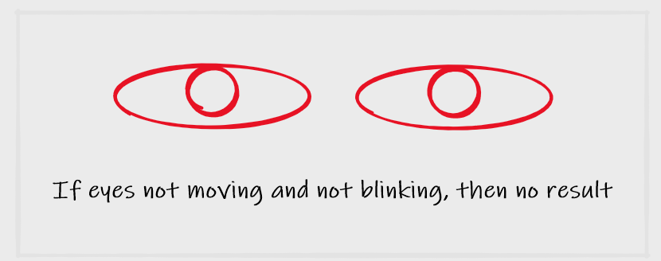
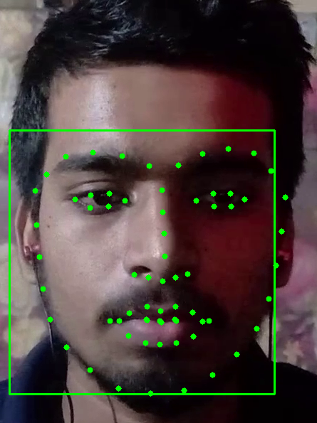
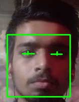
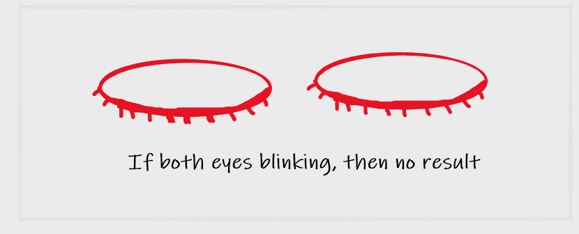
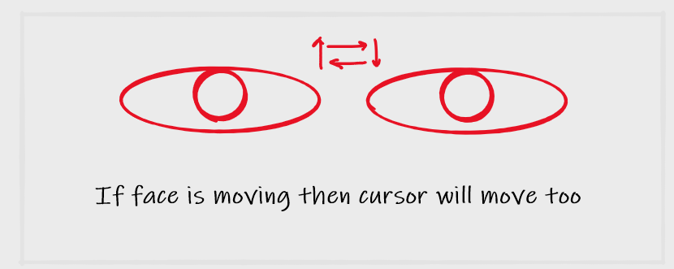

# EYE_MOUSE 
# License  
This repository is licensed to rightful owner: HARSHSINGH0 
that generally means you have no permission from the creators of the software to use, modify, or share the software. Although a code host such as GitHub may allow you to view and fork the code, this does not imply that you are permitted to use, modify, or share the software for any purpose. 
# About 
This repository is created to possibly make project where user or consumer can handle mouse comtrol from eyes 
In our system the cursor movement of computer is controlled by finding mean of both eyes (landmarks between both eyes) and using Open CV.Camera detects the Eye ball movement which can be processed in OpenCV.By this the cursor can be controlled.

 
 
 
 
 
# Dependencies
before running project 
anaconda python (better for working on venv) 
opencv-python (for working with video capture) 
numpy (for mathematical purpose) 
pynput (for mouse handle) 
cmake (for installing dlib) 
make sure to install visual c++ (this is required for installation of dlib) 
dlib (for pointing out the landmarks of face) 
pywin32 (for getting screen size) 
pyqt5 (for making interface) 
pyqt5-tools (for working on pyqt designer) 
