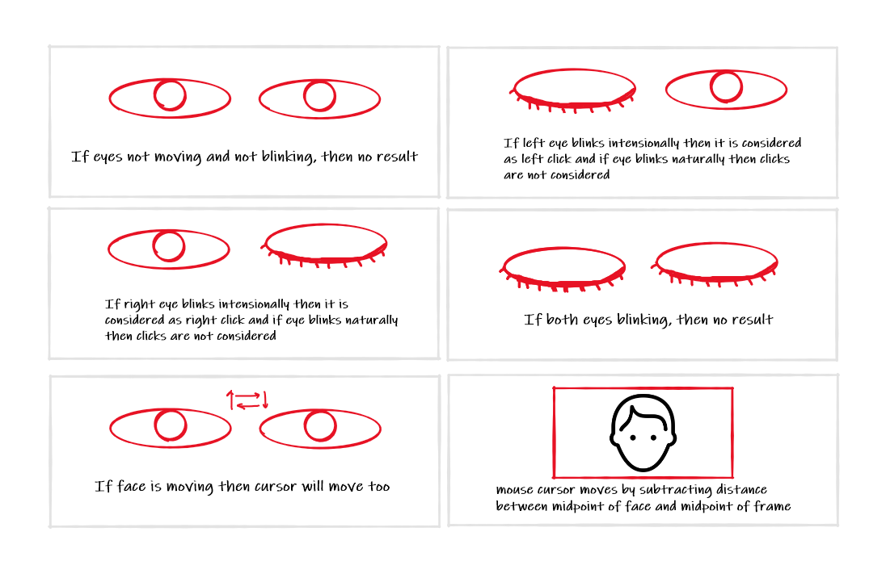

# EYE_MOUSE 
# License  
This repository is licensed to rightful owner: HARSHSINGH0 
that generally means you have no permission from the creators of the software to use, modify, or share the software. Although a code host such as GitHub may allow you to view and fork the code, this does not imply that you are permitted to use, modify, or share the software for any purpose. 
# About 
This repository is created to possibly make project where user or consumer can handle mouse comtrol from eyes 
In our system the cursor movement of computer is controlled by finding mean of both eyes (landmarks between both eyes) and using Open CV.Camera detects the Eye ball movement which can be processed in OpenCV.By this the cursor can be controlled.
 
# INTERFACE  
The interface of the eye mouse controller is basically to take input and show the webcam’s video feed, start tracking, and detecting blinks. 
 
 After starting the eye mouse controller application first user needs to input the camera number, if it a laptop camera number default value is 1 and the user had attached an external camera then the user will input number 2 as a value if multiple cameras are attached and then user need to input correct camera number to run the application. After keying the correct camera number Enter button needs to be pressed. 
  
After adding the camera number user need to specify the aspect ratio of the camera which is used as a webcam. Most of the webcam comes with 4:3 as an aspect ratio so our application comes compatible with 4:3. If the camera-input aspect ratio is 16:9 then the user needs to input selection in the aspect ratio checkbox. 
 
After choosing the correct aspect ratio user check whether a camera is flipped by default. If a webcam is flipped then check the inverse camera button. It will reverse the flipping and tracking will happen in exact order. 
 
After choosing correct alternatives user need to balance out the lighting with help of illumination slider which helps in low light condition. Illumination slider comes with 3 values 1/2/3. The default value is one of the value increase by 1 then the gamma value increases in a video frame. 

And here is the full view of the interface of the Eye Mouse Controller.  
In this application for easy use and no repetitive assignment of camera number, the camera number is saved in a file where it stores the last used camera number which is used to run OpenCV frame with previously used frame. 

# OPENCV FRAME  
After configuring all the settings, a user selects enter to run a program and gets a new window started of OPENCV video capture. Which illustrates how a face is being recognized and shows the distance between the face midpoint and the camera midpoint. 
It also shows if a user is far from a frame or not, user can different by looking at the video frame how gradually cursor speed is increasing. 

 
Here if the user's face is in the middle circle then the cursor not moving, and if a face is in the second circle then the cursor moves slowly, and if the face crosses 2nd circle then the cursor moves at a faster speed.
Users can click the letter ‘Q’ to exit. By clicking ’Q’ the user just exits out of the OpenCV video frame.
To exit the full program user need to close the interface too.

# Dependencies
before running project 
anaconda python (better for working on venv) 
opencv-python (for working with video capture) 
numpy (for mathematical purpose) 
pynput (for mouse handle) 
cmake (for installing dlib) 
make sure to install visual c++ (this is required for installation of dlib) 
dlib (for pointing out the landmarks of face) 
pywin32 (for getting screen size) 
pyqt5 (for making interface) 
pyqt5-tools (for working on pyqt designer) 
